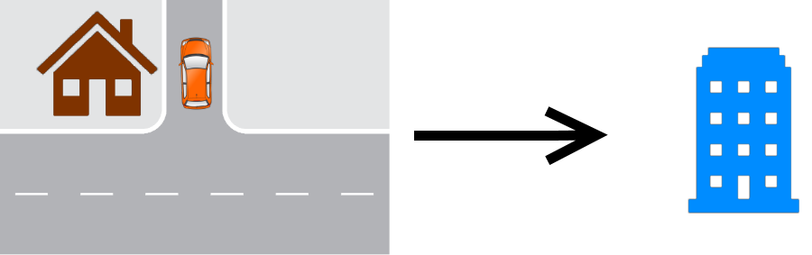
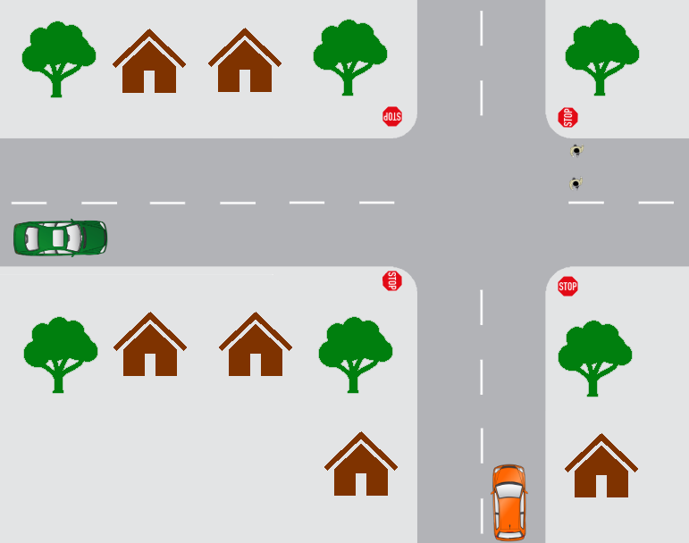
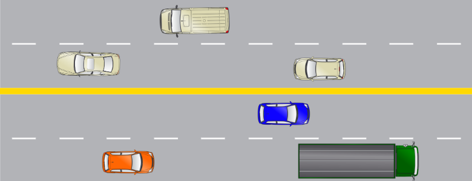
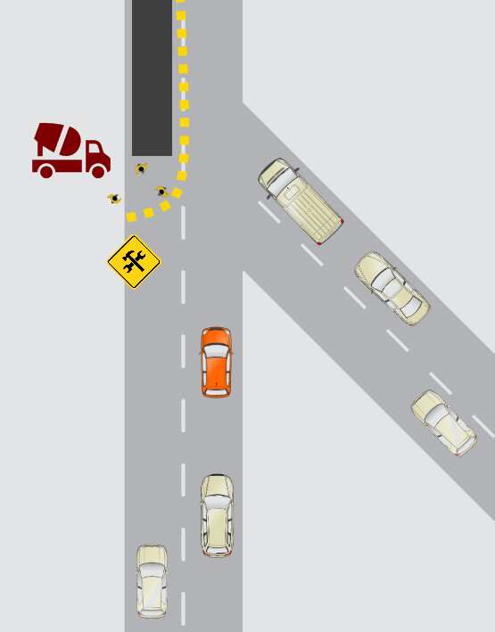
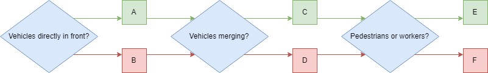
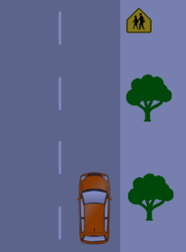

# MODULE 1 : GRADED QUIZ

---

  

**1.** Scenario 1: You’re at home and need to drive to work

During the trip, you will be performing OEDR tasks. Of the tasks below, which of the following is **not** an example of OEDR?

**Ans : ** 

- [ ] Slowing down when seeing a construction zone ahead
- [ ] Pulling over upon hearing sirens
- [ ] Stopping at a red light
- [x] Maintaining a distance to a vehicle ahead

  

**2.** Which of the following tasks are associated with **perception**?

**Ans : ** 

- [x] Identifying road signs
- [ ] Responding to traffic lights
- [ ] Planning routes on a map
- [x] Estimating the motion of other vehicles

  

**3.** Before leaving, you decide to check the weather. The forecast states that over the next few days there will be both sun and rain along with some fog. Assuming your vehicle exhibits Level 5 autonomy, which of the following **weather conditions** can your vehicle operate? 

**Ans : ** 

- [ ] Clear and sunny
- [ ] Windy heavy rainfall
- [ ] Heavy Fog
- [ ] Light rainfall
- [x] All of the above

  

**4.** You enter your autonomous vehicle and it drives your usual route to work. While the vehicle is driving, you decide to take a nap. For **which levels of autonomy** is this safe? (Select all that apply) 

**Ans : ** 

- [ ] 1
- [ ] 2
- [ ] 3
- [x] 4
- [x] 5

  

**5.** **Scenario 2:** Assume the car is driving on the right-hand side of the road.

You’re approaching an all ways stop sign and you want to make a right turn. Your vehicle is denoted in orange. There are 2 pedestrians currently crossing and another vehicle (denoted in green) approaching the stop sign from the left.

This task involves multiple considerations, which of them are **predictive planning**? Select all that apply.

**Ans : ** 

- [ ] At a stop sign, stop and look both ways before proceeding
- [x] Wait for the pedestrians to finish crossing before turning
- [x] The green car arrives at the stop sign after you and plans to  travel straight through the intersection. You choose to move first.
- [ ] Gradually decelerate while reaching the stop sign

  

**6.** Here are some rules for driving at a stop sign. Which of the following is an appropriate **priority ranking**?

1) For non all-way stop signs, stop at a point where you can see oncoming traffic  without blocking the intersection

2) If there are pedestrians crossing, stop until they have crossed

3) If you reach a stop sign before another vehicle, you should move first if safe

**Ans : ** 

- [ ] 1, 2, 3
- [ ] 3, 2, 1
- [x] 2, 1, 3
- [ ] 3, 1, 2
- [ ] 1, 3, 2

  

**7.** Which of the following are **off-road objects**? (Select all that apply) 

**Ans : ** 

- [ ] Pedestrians
- [ ] Road markings
- [x] Stop signs
- [x] Trees
- [x] Curbs

  

**8.** Suppose your vehicle has **lane keeping assistance**, which of these objects are relevant for its performance? (Select all that apply) 

**Ans : ** 

- [ ] Pedestrians
- [ ] Trees
- [ ] Stop signs
- [x] Curbs
- [x] Road markings

  

**9.** Which of the following sensors are used for the **lane keeping assistance**? (Select all that apply)

**Ans : ** 

- [ ] Barometers
- [x] GPS
- [x] IMU
- [x] LIDAR
- [x] Cameras

  

**10.** **Scenario 3:** You are on the highway and you see a truck in front of you. Assume the car is driving on the right-hand side of the road. There is also a blue car beside the truck in the other lane.

Your vehicle follows the truck and maintains a constant distance away. What kind of **control** is this?

**Ans : ** 

- [ ] OEDR
- [ ] Fallback
- [x] Longitudinal
- [ ] Lateral

  

**11.** You decide to **change lanes** to pass a truck. What kind of decision is this?

**Ans : ** 

- [ ] Immediate
- [ ] Reactive
- [ ] Long term planning
- [ ] Rule-based planning
- [x] Short term planning

  

**12.** Which of the following tasks are **rule-based planning**? (Select all that apply) 

**Ans : ** 

- [x] If there are vehicles directly beside us on the lane, it is unsafe to lane change.
- [ ] If the vehicle in front is going to slow down sharply, then avoid performing a lane change.
- [x] During a lane change, maintain our current speed or accelerate slightly

  

**13.** Suppose the blue vehicle suddenly brakes and you decide to abort the lane change. If your vehicle can **respond automatically and remain in its own lane**, what is the minimum level of autonomy of your vehicle?

**Ans : ** 

- [x] 3
- [ ] 2
- [ ] 5
- [ ] 4
- [ ] 1

  

**14.** The blue vehicle returns to normal speed and you can now safely change lanes. Your car is **performing the lane change**, what kind of control is this?

**Ans : ** 

- [ ] Longitudinal
- [ ] Fallback
- [ ] OEDR
- [x] Lateral

  

**15.** **Scenario 4:** You are almost at work but encounter a construction site. 

Assume the car is driving on the right-hand side of the road. Your vehicle is denoted in orange.

You see a  construction site where the workers are repaving a road full of  potholes. They are using jackhammers which can cause dust clouds.

You  create the following decision tree for getting through the construction  site. From the diagram, which of the following decisions should you  make? **(green is true, red is false)** 

**Ans : ** 

- [ ] A (True)
- [x] B (False)
- [x] C (True)
- [ ] D (False)
- [x] E (True)
- [ ] F (False)

  

**16.** Here are a set of rules for making these decisions, **arrange them in an appropriate prioritization**.

1) If there are no vehicles ahead, accelerate to the speed limit

2) Drive slowly in construction zones

3) If there are pedestrians or workers directly ahead in the current lane, stop

4) Yield to merging vehicles, if necessary 

**Ans : ** 

- [ ] 1, 2, 3, 4
- [ ] 2, 3, 4, 1
- [ ] 3, 4, 1, 2
- [x] 3, 4, 2, 1

  

**17.** **Scenario 5:** You’re finished work and need to drive back home, but it’s nighttime.

You plan a new path home on your GPS application to avoid the construction site, **what type of planning is this**?

**Ans : ** 

- [x] Long term planning
- [ ] Rule based planning
- [ ] Immediate
- [ ] Short term planning
- [ ] Reactive

  

**18.** Your new path goes through a school zone and you see the school zone sign. You decide to slow down despite there being no pedestrians or children (it’s nighttime). What sort of **planning** is this?

**Ans : ** 

- [x] Rule based planning
- [ ] Immediate planning
- [ ] Reactive planning
- [ ] Long term planning
- [ ] Short term planning

