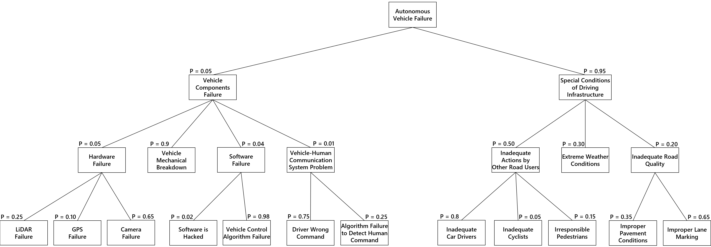

# MODULE 3 : GRADED QUIZ

---

  

**1.** Which from the below options is the most **ACCURATE** and **COMPLETE** definition of **risk** in terms of self-driving vehicles?

**Ans : ** Risk is a probability that an event occurs combined with the severity of the harm that the event can cause

  

**2.** Which of the following are **major components** of an autonomous driving system? 

**Ans : ** 

- [ ] Adaption
- [x] Perception
- [ ] Configuration
- [x] Control
- [x] Planning

  

**3.** What are the most common categories of autonomous vehicle **hazard sources**?

**Ans : ** 

- [x] Malicious software
- [x] Electrical and mechanical
- [x] Perception and planning
- [x] Hardware and software
- [x] Driver inattention

  

**4.** The safety framework to structure safety assessment for autonomous driving defined by NHTSA is **MANDATORY** to follow.

**Ans : ** False

  

**5. ** Which categories are included in the **safety framework** to structure safety assessment for autonomous driving defined by NHTSA?

**Ans : ** 

- [x] Well-organized software development process
- [x] Testing and crash mitigation
- [ ] Digital vehicle model design
- [x] Autonomy design

  

**6. ** Which actions are needed to be performed **in the event of an accident** by an autonomous vehicle?

**Ans : ** 

- [ ] Locking all doors
- [x] Returning car to a safe state
- [x] Securing fuel pumps
- [x] Data recording to a black box
- [x] Alerting first responders

  

**7. ** What are the **most common** accident scenarios?

**Ans : ** 

- [x] Road departure
- [x] Intersection
- [x] Lane change
- [ ] Crosswalk
- [x] Rear-end 
- [ ] Rollover

  

**8. ** What kind of **safety system** is described by the following definition?
This system can be analyzed to define quantifiable safety performance based on critical assessment of various scenarios.

**Ans : ** Analytical safety

  

**9. ** According to the report by Rand Corporation, autonomous driving of 8.8 billion miles is required to demonstrate human-level fatality rate of an autonomous vehicle fleet using a 95% Confidence Interval. **How many years** is required to perform this testing with a fleet of 100 vehicles running 24 hours a day, 7 days a week at an average of 25 miles per hour? Your answer should be an integer.

**Ans : ** 400

  

**10. ** Given that an autonomous vehicle failure has happened and based on this tree, **what is the probability** that the failure happened because of Vehicle Control Algorithm Failure OR Inadequate Car Drivers? Please give your answer with the precision of 3 decimal places.

**Ans : ** 0.382

  

**11. ** Given that the autonomous vehicle failure has happened, and based on this tree**, what is the probability** that the failure happened because of Software Failure AND Extreme Weather Conditions at the same time? Please give your answer with the precision of 3 decimal places.

**Ans : ** 0.001

  

**12. ** A computer vision algorithm is responsible for extracting meaningful data from the onboard camera. A computer vision failure restricts the vehicle's ability to navigate the environment around it, hence a problem with this system is a serious failure. However, LiDAR and radar sense similar environment data, so a computer vision failure does not leave the vehicle completely blind. A Computer vision algorithm failure can be considered a somewhat severe failure as it decreases vehicle sensing ability and it gets a severity score of 5. This could happen regularly in low light situations, hence the occurrence number is assigned 4. Computer vision algorithm failure is fairly detectable in majority of 
the situations, so the detectability score is 3.

**What is the risk priority number for a Computer vision algorithm failure** according to FMEA and based on the description above?  Your answer should be an integer. 

**Ans : ** 60

  

**13. ** There are failures listed below. Which failures should we focus on **solving first** according to FMEA?

**Ans : ** Vehicle driving onto a gravel road (risk priority score of 400)

  

**14. ** Which of the following options is the most **ACCURATE** and **COMPLETE** definition of **functional safety** in terms of self-driving vehicles?

**Ans : ** Functional safety is the detection of a potentially dangerous condition resulting in the activation of a protective or corrective device or mechanism to prevent hazardous events arising or providing mitigation to reduce the consequence of the hazardous event

  

**15. ** Which of the following standards defines **functional safety terms** and **activities for electrical and electronic systems** within motor vehicles?

**Ans : ** ISO 26262