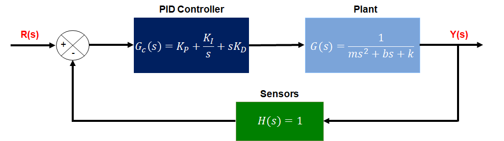
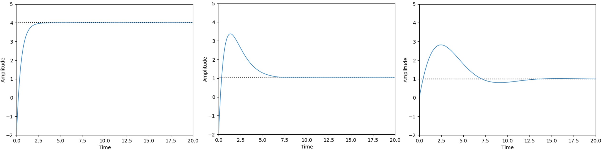
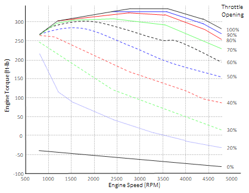
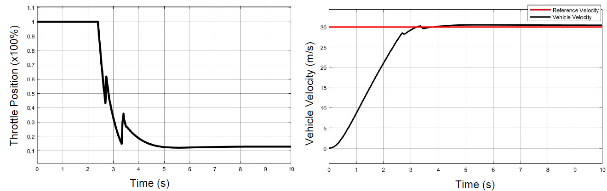
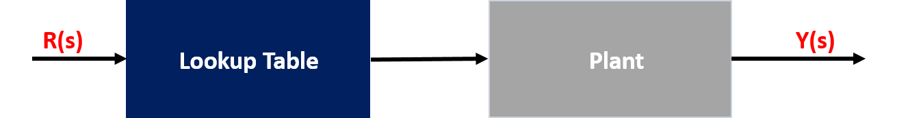

# MODULE 5 : GRADED QUIZ

---

  

**1. ** What is the **order** of the following transfer function?
$$
G(s) = \frac{s - 10}{s^2 + 2s + 1}
$$
**Ans : ** This is the second order transfer function

  

**2. ** What are the **poles and zeros** of the following transfer function?
$$
G(s) = \frac{s^2 + 3s - 10}{s^2 - s - 12}
$$
**Ans : ** The poles are -3 and 4; the zeros are 2 and -5

  

**3. ** What might be your action as a system control engineer if you need to **increase the overshoot** of a control loop system? (Select all that apply)

**Ans : ** 

- [ ] Increase Kd
- [ ] Decrease Ki
- [x] Increase Kp
- [x] Increase Ki
- [ ] Decrease Kp
- [ ] Decrease Kd

  

**4. ** Recall the Mass-Spring-Damper System example form the video on PID Control.  This system is shown in the figure below.

As a system control engineer, you constructed the following closed loop transfer function to represent the Mass-Spring-Damper System. What is the **correct transfer function** for this closed loop?

**Ans : ** 
$$
G(s) = \frac{K_Ds^2 + sK_P + K_I}{ms^3 + (b + K_D)s^2 + (k + K_P)s + K_I}
$$
  

**5. ** You are given the step response of a few different PID controllers using the same gains for the same first order transfer function. **Determine a possible set of controllers** that generated these step responses:

**Ans : ** 1st response by PD; 2nd response by PID; 3rd response by PI  

  

**6. ** What is the output of a typical output of a Longitudinal control module? (Select all that apply)

**Ans : ** 

- [ ] Reference Velocity
- [x] Throttle angle
- [ ] Steering angle
- [x] Brake Position

  

**7. ** Based on the engine map in the figure below, **determine the throttle angle** needed to produce 250 ft-lb of torque given that the current engine speed is 3500 RPM.

**Ans : **60

  

**8. ** The results of a simulation of the control response to a step change in desired speed of adynamic vehicle model with a PID controller are shown in the figures below. There are two spikes on these figures: one spike is between 2 and 3 seconds, another spike is between 3 and 4 seconds. **What is the reason of these spikes?**

**Ans : ** Nonlinear engine map

  

**9. ** What type of **control system** is shown in the figure below?

**Ans : ** Feedforward control

  

**10. ** What types of inaccuracies are corrected by a feedback controller? 

**Ans : ** 

- [x] Disturbances
- [ ] Nonlinear engine map
- [x] Errors in the plant model
- [ ] High level controller simplification: changing the integral to a summation over fixed length time steps in the Integral term

  

**11. ** What assumptions are essential for creation of a **longitudinal feedforward input**? (Select all that apply)

**Ans : ** 

- [ ] Torque from the engine passes directly to the transmission without loss
- [ ] The plant system is linear
- [ ] The tire slip angle and ratio are negligible
- [x] The vehicle is at steady state

  

**12. ** What are the sources of the load torque considered for a **longitudinal feedforward look-up table computation**? (Select all that apply) 

**Ans : ** 

- [ ] Sliding resistance
- [x] Aerodynamic resistance
- [ ] Cornering force
- [ ] Static friction
- [x] Rolling resistance
- [x] Gravitational resistance

  

***13. ** A vehicle is being operated on a highway with the reference velocity of 126 km/h (35 m/s) in gear 4 and it overcomes the total load torque of 300 ft-lb. This vehicle specification includes effective wheel radius of 0.35 m and 4th gear ratio of 2. **What throttle angle** is required for maintaining the the current speed of the vehicle? 

**Ans : ** 70