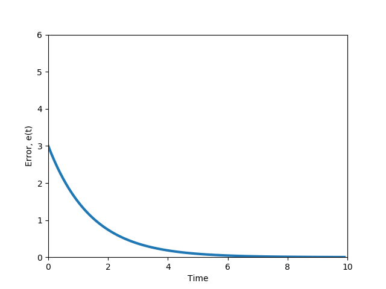

MODULE 6 : GRADED QUIZ

---

  

**1. ** Which reference path is the **most compact** and **easy to construct**?

**Ans : ** Track straight line segment

  

**2. ** What is the most **ACCURATE** and **PRECISE** definition of the crosstrack error?

**Ans : ** The crosstrack error is the distance between the vehicle reference point and the closest point on the reference path.

  

**3. ** What vehicle reference frame is used in a **pure pursuit controller**?

**Ans : ** Center of the rear axle

  

**4. ** **Compute the radius** from the instantaneous center of rotation to the center of the vehicle rear axle  (in m) required for an autonomous vehicle to follow the desired path based on the information below.

The lookahead distance is 10 m; the car length is 4 m; the angle between the vehicle’s body heading and the lookahead line is 30°. Your answer should be an integer. 

**Ans : ** 10

  

**5. ** **Compute the steering angle (in degrees)** required for an autonomous vehicle with pure pursuit lateral control for following the desired path based on the information below.

The lookahead distance is 15 m; the car length is 5 m; the angle between the vehicle’s body heading and the lookahead line is 60°.

**Ans : ** 30

  

**6. ** Consider a  situation in which a vehicle traveling speed has decreased from 100 km/h to 50 km/h. This vehicle lateral control is implemented with a pure pursuit controller where ld is assigned as a function of vehicle speed. **How should ld change in this situation?** 

**Ans : ** ld should decrease

  

**7. ** What are **major components** of the Stanley controller?  (Select all that apply)

**Ans : ** 

- [x] Steering angle command is restricted to the min and max steering angles
- [x] Steering angle is set equal to the heading direction to eliminate heading error relative to the path
- [ ] Derivative control is introduced for minimizing the heading error
- [ ] Crosstrack error is eliminated
- [ ] Integral control is added for both the heading and the crosstrack errors optimization 
- [x] Proportional control is introduced for minimizing the crosstrack error

  

**8. ** **What is the correct figure** of the crosstrack error dynamics for a small error value(where e′(t)=−ke(t)) ?

**Ans : **

  

**9. ** **What is the value of the crosstrack error**, governed by the ODE e′(t)=−ke(t), at t=2 given that e(0)=4 and k=1?

**Ans : ** 0.54

  

**10. ** Which of the statements below about Model Predictive Control (MPC) are **TRUE**? (Select all that apply)

**Ans : ** 

- [x] The formulation of an MPC controller is straightforward 
- [x] MPC works for both linear and nonlinear models
- [ ] MPC is an optimized version of Receding Horizon Control
- [x] MPC can impose constraints on the states and the input simultaneously  

  

**11. ** What is the typical way of finding the solution for a **nonlinear vehicle dynamics model** given an input function?

**Ans : ** Numerical optimization

  

**12. ** What is the output of the **Model Predictive Controller** described in this course? (Select all that apply)

**Ans : ** 

- [ ] Throttling/braking
- [ ] Steering angle
- [x] Longitudinal forces
- [x] Lateral forces
- [ ] None of the above

